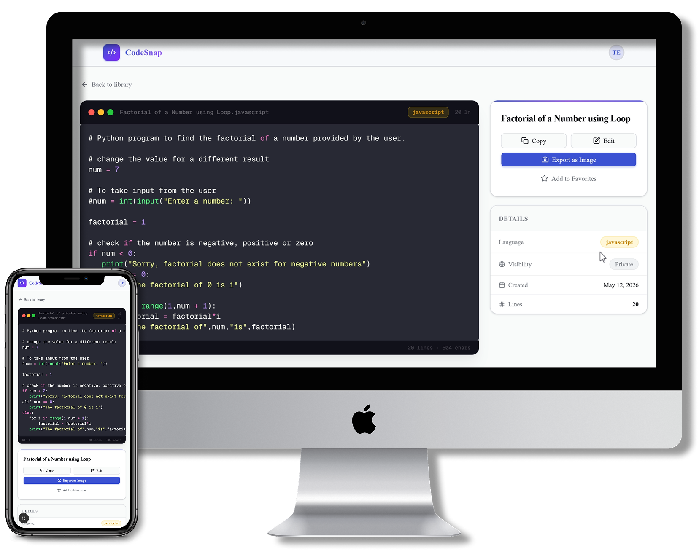

# CodeSnap — Beautiful Code Snippet Manager

> Save, organize, and share your code snippets with stunning visuals.

**[Live Demo](https://codesnap-virid.vercel.app/)**


<!-- Replace with an actual screenshot -->
<!--  -->

## Overview

**CodeSnap** is a full-stack code snippet manager built with Next.js (App Router), TypeScript, and Supabase. It lets developers save, organize, and share code with beautiful syntax-highlighted screenshots — think of it as a personal snippet library that doubles as a code image generator.

Built to demonstrate production-grade patterns: Row Level Security in PostgreSQL, Supabase Auth with OAuth, strict server/client component separation in the Next.js App Router, optimistic UI updates, and a fully type-safe API layer.

## Features

- **11 Syntax Themes** — Dracula, Monokai, One Dark Pro, Nord, Tokyo Night, GitHub Dark/Light, and more
- **Export as Images** — Generate beautiful PNG screenshots at 1×, 2×, and 3× resolution
- **Tag-Based Organization** — Organize snippets with custom tags and filter instantly
- **Full-Text Search** — PostgreSQL-powered search across titles, code, and descriptions
- **Private by Default** — Snippets are private unless explicitly shared
- **Public Sharing** — Generate unique shareable links for any snippet
- **Window Mockups** — macOS, Windows, or minimal frame styles
- **Custom Backgrounds** — Solid colors, gradients, or transparent
- **Dark / Light Mode** — Persisted system-aware theme toggle
- **Responsive Design** — Fully usable on mobile and desktop

## Tech Stack

| Category                | Technology                     |
| ----------------------- | ------------------------------ |
| **Framework**           | Next.js 16 (App Router)        |
| **Language**            | TypeScript 5                   |
| **Database**            | Supabase (PostgreSQL)          |
| **Authentication**      | Supabase Auth (Email + OAuth)  |
| **Styling**             | Tailwind CSS v4 + shadcn/ui    |
| **Syntax Highlighting** | Shiki (VS Code engine)         |
| **Image Generation**    | html-to-image                  |
| **Deployment**          | Vercel                         |

## Architecture Highlights

- **Server Components** for data fetching — zero client-side waterfalls on page load
- **API Routes** with input validation and field-level allowlisting
- **Row Level Security** — all Supabase queries enforced at the database level
- **Edge Middleware** — Supabase session refresh + auth redirect on every request
- **Optimistic UI** — favorite and delete actions update instantly with rollback on failure

## Quick Start

### Prerequisites

- Node.js 18+
- A free Supabase account

### Local Development

```bash
git clone https://github.com/dotrainier/codesnap.git
cd codesnap
npm install
cp .env.example .env.local
```

Edit `.env.local` with your Supabase credentials:

```
NEXT_PUBLIC_SUPABASE_URL=https://your-project-id.supabase.co
NEXT_PUBLIC_SUPABASE_ANON_KEY=your-anon-key-here
```

```bash
npm run dev
```

### Supabase Setup

1. Create a new project at [supabase.com](https://supabase.com)
2. Open the **SQL Editor** and run the full schema from [`supabase/schema.sql`](supabase/schema.sql)
3. (Optional) Enable GitHub and/or Google OAuth under **Authentication → Providers**
4. Copy your **Project URL** and **anon key** from **Settings → API** into `.env.local`

The schema file includes:
- The `snippets` table with all columns
- Indexes on `user_id`, `share_id`, and `created_at`
- A GIN index on the `tags` array for fast filtering
- An `updated_at` trigger
- All four Row Level Security policies

### Environment Variables

| Variable | Required | Description |
| -------- | -------- | ----------- |
| `NEXT_PUBLIC_SUPABASE_URL` | ✅ | Your Supabase project URL |
| `NEXT_PUBLIC_SUPABASE_ANON_KEY` | ✅ | Your Supabase anon (public) key |

## Deployment

1. Push to GitHub
2. Import the repository on [vercel.com](https://vercel.com)
3. Add both environment variables in the Vercel dashboard
4. Deploy — live in under 2 minutes

## Contributing

1. Fork the repository
2. Create a feature branch (`git checkout -b feature/your-feature`)
3. Commit your changes
4. Push and open a Pull Request

## License

MIT License — free to use for personal or commercial projects.

## Acknowledgments

Inspired by [Carbon](https://carbon.now.sh), [Ray.so](https://ray.so), and [Snappify](https://snappify.com).
